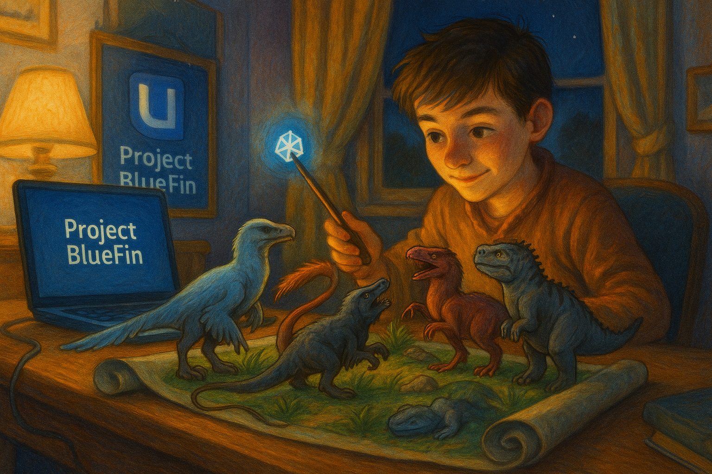

# Dudley's Second Bedroom

A step up from the closet under the stairs, but not quite the Room of Requirement yet.

This [Universal Blue](https://github.com/ublue-os/main) image extends the [Bluefin](https://github.com/ublue-os/bluefin) flavor with personalized modifications - your own space that's better than where you started, but with room to grow into something even better.

## ✨ What's New: Modular Build System

This image uses a **modular build architecture** that makes customization easier and builds faster:

### Key Benefits

- **🔧 Easy to Customize**: Add or modify features by editing modular scripts in `build_files/`
- **⚡ Fast Rebuilds**: Intelligent caching means most changes rebuild in <10 minutes (vs 30+ minutes)
- **✅ Validated**: Automatic validation ensures your customizations are correct before building
- **📦 Organized**: Build modules categorized by function: shared, desktop, developer, user-hooks
- **🔄 Smart Updates**: Automatic content-based versioning - hooks only run when their dependencies change

### Quick Customization

**Add a package:**
```bash
# Edit packages.json
{
  "all": {
    "install": ["your-package-here"]
  }
}
```

**Add a custom build module:**
```bash
# Create build_files/developer/my-tool.sh
#!/usr/bin/bash
# Script: my-tool.sh
# Purpose: Install my custom tool
# Category: developer
# Dependencies: none
# Parallel-Safe: yes
# ...
```

**Validate and build:**
```bash
just check    # Validate changes
just build    # Build image
```

### Architecture

See [ARCHITECTURE.md](./ARCHITECTURE.md) for complete documentation of the modular build system.

## 🔄 Automatic Content-Based Versioning

**Zero-maintenance version management** - your hooks automatically track when they need to run.

### How It Works

The build system computes content hashes (SHA256) of each user hook and its dependencies. Hooks only re-execute when their content actually changes:

- **Wallpaper hook**: Tracks wallpaper images + hook script
- **VS Code extensions**: Tracks vscode-extensions.list + hook script
- **Welcome message**: Tracks only the hook script

**No manual version bumping required!**

### Build Manifest

Every image includes a build manifest at `/etc/dudley/build-manifest.json` containing:
- Build timestamp and git commit
- Content version hash for each hook
- List of tracked dependencies

Example:
```json
{
  "version": "1.0.0",
  "build": {
    "date": "2025-10-10T14:55:15Z",
    "commit": "a55df81"
  },
  "hooks": {
    "vscode-extensions": {
      "version": "0dfa5280",
      "dependencies": [
        "build_files/user-hooks/20-vscode-extensions.sh",
        "vscode-extensions.list"
      ]
    }
  }
}
```

### Benefits

- **Smart Updates**: Hooks only run when needed
- **Fast Reboots**: Unchanged hooks skip instantly
- **Transparent**: See exactly what changed in each build
- **Automatic**: No version numbers to manage manually

### View Build Information

Use the `dudley-build-info` command to view build details at any time:

```bash
# Formatted display
dudley-build-info

# Raw JSON output
dudley-build-info --json
```

### Developer Documentation

For developers adding new hooks or modifying the versioning system:

- **Developer Guide**: [docs/DEVELOPER-GUIDE.md](./docs/DEVELOPER-GUIDE.md)
- **Quickstart**: [specs/002-implement-automatic-content/quickstart.md](./specs/002-implement-automatic-content/quickstart.md)
- **API Contracts**: [specs/002-implement-automatic-content/contracts/](./specs/002-implement-automatic-content/contracts/)
- **Template Hook**: [build_files/user-hooks/TEMPLATE-new-hook.sh](./build_files/user-hooks/TEMPLATE-new-hook.sh)

See [specs/002-implement-automatic-content/](./specs/002-implement-automatic-content/) for complete documentation.

## Default Wallpaper & Branding

**Dynamic multi-image wallpaper system** for desktop sessions only:

### How It Works

The build system automatically discovers and installs **any PNG/JPG images** from the `custom_wallpapers/` directory.

**Current wallpapers:**
- `custom_wallpapers/dudleys-second-bedroom-1.png` → Primary desktop background
- `custom_wallpapers/dudleys-second-bedroom-2.png` → Secondary wallpaper (available for user selection)

### Build Process

1. **Discovery**: Scans `custom_wallpapers/` for `*.png`, `*.jpg`, `*.jpeg` files
2. **Installation**: Copies all found images to `/usr/share/backgrounds/dudley/`
3. **Schema Override**: Sets a safe fallback default (`dudleys-second-bedroom-1.png`)
4. **Login Randomizer**: `/usr/bin/dudley-random-wallpaper` picks a random image (avoids immediate repeats) and applies it
5. **Autostart**: `/etc/xdg/autostart/dudley-random-wallpaper.desktop` runs the randomizer each GNOME login/session start
6. **User Hook**: `10-wallpaper-enforcement.sh` invokes the same randomizer on first login (content-version tracked)
7. **Login Screen**: Uses default Bluefin branding (no custom wallpaper)

### Adding/Changing Wallpapers

**Simple method:**
1. Add/replace images in `custom_wallpapers/` directory
2. Keep `dudleys-second-bedroom-1.{png|jpg}` as your primary wallpaper
3. Add numbered variants like `dudleys-second-bedroom-3.png`, etc.
4. Rebuild & rebase

**Advanced options:**
- Create XML slideshow definitions for rotating backgrounds
- Modify schema overrides for different light/dark wallpapers
- Add wallpaper categories or themes

Runtime user override (doesn’t modify the image):

```bash
gsettings set org.gnome.desktop.background picture-uri "file:///path/to/custom.png"
```

If removing branding entirely, delete the schema + dconf override files and rebuild.

### Manual Runtime Testing

Run random selection immediately in the current session:

```bash
/usr/bin/dudley-random-wallpaper
```

Run first-login hook manually (for troubleshooting/versioning checks):

```bash
bash /usr/share/ublue-os/user-setup.hooks.d/10-wallpaper-enforcement.sh
```

### VS Code Extensions

VS Code extensions are automatically installed from the list at `/usr/share/ublue-os/vscode-extensions.list` once a compatible CLI is available. The hook prefers Homebrew-managed `code-insiders`, falls back to `code` if needed, and uses the ublue versioning system to track installation state in `~/.local/share/ublue/setup_versioning.json`.

The hook will:
- Install all extensions listed in the file on first run
- Wait until VS Code is actually installed before recording a successful run
- Create a marker at `~/.config/Code - Insiders/.extensions-installed` or `~/.config/Code/.extensions-installed` for debugging
- Skip installation on subsequent boots (version already recorded)
- Re-run automatically if the hook version is updated in a new image

Manual install/update through the consolidated Dudley entrypoint:
```bash
ujust dudley extensions
```

Manual force reinstall (resets version tracking and reinstalls):
```bash
ujust dudley extensions force
```

Reset version tracking manually:
```bash
# Edit the setup versioning file to remove vscode-extensions entry
jq 'del(.version.user."vscode-extensions")' ~/.local/share/ublue/setup_versioning.json > /tmp/setup.json && mv /tmp/setup.json ~/.local/share/ublue/setup_versioning.json
# Then run the hook
bash /usr/share/ublue-os/user-setup.hooks.d/20-vscode-extensions.sh
```

Check which extensions are configured:
```bash
cat /usr/share/ublue-os/vscode-extensions.list
```

Check current version tracking:
```bash
jq '.version.user."vscode-extensions"' ~/.local/share/ublue/setup_versioning.json
```

## Homebrew Package Installation

The image includes curated Brewfile configurations for installing additional tools via Homebrew. These packages are organized by category and exposed through a single `ujust dudley` entrypoint.

### Available Brewfile Categories

- **CLI Tools** (`dudley-cli.Brewfile`): Terminal utilities like `bat`, `eza`, `ripgrep`, `starship`, `zoxide`
- **Development Tools** (`dudley-dev.Brewfile`): Development environments including VS Code Insiders, Python, Node.js, Ansible, UV
- **Fonts** (`dudley-fonts.Brewfile`): Nerd Fonts collection for terminal and code editors
- **Kubernetes/Cloud-Native** (`dudley-k8s.Brewfile`): kubectl, helm, k9s, kind, and container tools

### Installation Commands

Primary entrypoints:
```bash
# Install all Dudley Brewfiles, then install VS Code extensions
ujust dudley

# Install just the development bundle
ujust dudley brew dev

# Install just the CLI bundle
ujust dudley brew cli

# Install just the fonts bundle
ujust dudley brew fonts

# Install just the Kubernetes bundle
ujust dudley brew k8s
```

List available bundles:
```bash
ujust dudley list
```

### Manual Installation

Brewfiles are stored at `/usr/share/ublue-os/homebrew/` and can be installed manually:
```bash
brew bundle --file=/usr/share/ublue-os/homebrew/dudley-cli.Brewfile
```

### Customizing Brewfiles

To add or modify packages:
1. Edit the appropriate Brewfile in the `brew/` directory
2. Rebuild the image
3. After rebasing, run the corresponding `ujust dudley ...` command

## Building with Custom Base Images

You can override the default base image (`ghcr.io/ublue-os/bluefin-dx:stable`) to test against other Universal Blue images (e.g., Aurora, Bazzite) or different tags.

### Local Build

Use the `BASE_IMAGE` environment variable:

```bash
# Build with Aurora DX
BASE_IMAGE="ghcr.io/ublue-os/aurora-dx:stable" just build

# Build with Bazzite
BASE_IMAGE="ghcr.io/ublue-os/bazzite:latest" just build
```

### CI/CD Build

The GitHub Actions workflow accepts these manual dispatch inputs:

1. Go to **Actions** > **Build container image**.
2. Click **Run workflow**.
3. Set **Base image** if you want to build from something other than `ghcr.io/ublue-os/bluefin-dx:stable`.
4. Optionally set **Primary publish tag** if you want an explicit tag name.
5. Click **Run workflow**.

Tag behavior:

- Default Bluefin DX builds publish the normal `latest`, `latest.YYYYMMDD`, and `YYYYMMDD` tags.
- Nvidia base images automatically publish under `nvidia` unless you override the tag.
- Other custom base images use a sanitized variant-based tag unless you override it.

Example manual Nvidia build:

```text
base_image: ghcr.io/ublue-os/bluefin-dx-nvidia:stable
image_tag: nvidia
```

## About This Image

This is a customized Universal Blue OS image that extends `ghcr.io/ublue-os/bluefin:stable` with:

- The System76 COSMIC desktop environment (from the `ryanabx/cosmic-epoch` COPR).
- Developer tooling like `tmux`, `curl`, `gcc-c++`, and curated Homebrew packages (including RCC via `ujust dudley brew dev`).
- Additional quality-of-life tweaks tailored for my specific workflow.

## Installation

To switch to this custom image from any bootc-compatible system, run:

```bash
sudo bootc switch ghcr.io/joshyorko/dudleys-second-bedroom:latest
```

After the command completes, reboot your system to boot into the new image.

## Community & Support

- [Universal Blue Forums](https://universal-blue.discourse.group/)
- [Universal Blue Discord](https://discord.gg/WEu6BdFEtp)
- [bootc discussion forums](https://github.com/bootc-dev/bootc/discussions)

# Repository Contents

## Containerfile

The [Containerfile](./Containerfile) defines the operations used to customize the selected image.This file is the entrypoint for your image build, and works exactly like a regular podman Containerfile. For reference, please see the [Podman Documentation](https://docs.podman.io/en/latest/Introduction.html).

## build.sh

The [build.sh](./build_files/build.sh) file is called from your Containerfile. It is the best place to install new packages or make any other customization to your system. There are customization examples contained within it for your perusal.

## build.yml

The [build.yml](./.github/workflows/build.yml) GitHub Actions workflow creates your custom OCI image and publishes it to GHCR. By default, the image name matches the repository name. Manual dispatch supports both `base_image` and `image_tag`, and the workflow automatically keeps non-default builds on separate tags so an Nvidia build does not overwrite `latest`.

### Image signing and supply-chain artifacts

The workflow supports comprehensive supply-chain security with SBOM generation, SLSA provenance attestation, and dual signing (key-based + keyless).

#### Attached Artifacts

Every production image includes:
- **SBOM (SPDX JSON)**: Software Bill of Materials listing all packages
- **SLSA Provenance**: Build attestation with Git SHA and workflow context
- **Build Metadata**: Archived specs, docs, and build_files as OCI artifact

#### Verification Methods

**Key-based Verification:**
```bash
cosign verify --key cosign.pub ghcr.io/joshyorko/dudleys-second-bedroom:latest
```

**Keyless (OIDC) Verification:**
```bash
cosign verify \
  --certificate-identity-regexp "https://github.com/joshyorko/dudleys-second-bedroom/.github/workflows/build.yml@refs/heads/main" \
  --certificate-oidc-issuer "https://token.actions.githubusercontent.com" \
  ghcr.io/joshyorko/dudleys-second-bedroom:latest
```

**Download SBOM:**
```bash
cosign download sbom ghcr.io/joshyorko/dudleys-second-bedroom:latest | jq .
```

**Verify Provenance:**
```bash
cosign verify-attestation \
  --type slsaprovenance \
  --key cosign.pub \
  ghcr.io/joshyorko/dudleys-second-bedroom:latest
```

**Pull Build Metadata:**
```bash
DIGEST=$(skopeo inspect docker://ghcr.io/joshyorko/dudleys-second-bedroom:latest | jq -r .Digest | cut -d: -f2)
oras pull "ghcr.io/joshyorko/dudleys-second-bedroom:sha256-${DIGEST}.metadata"
tar -xzf metadata.tar.gz
```

#### Setup for Signing

To enable repository-based key signing, add a repository secret named `COSIGN_PRIVATE_KEY` containing your private key (PEM) exported as the raw value.

Key points:
- The workflow only signs/attests and publishes artifacts when running on the default branch
- Key-based signing requires the `COSIGN_PRIVATE_KEY` secret
- Keyless signing uses GitHub OIDC (requires `id-token: write` permission)
- Both signing methods are applied for maximum verification flexibility

#### Further Reading

- **Quick Start Guide**: [specs/004-oci-supply-chain/quickstart.md](./specs/004-oci-supply-chain/quickstart.md)
- **Signature Verification**: [docs/SIGNATURE-VERIFICATION.md](./docs/SIGNATURE-VERIFICATION.md)
- **Policy Examples**: [docs/signature-policy/](./docs/signature-policy/)

# Building Installer Media

This repo now follows the current Bluefin-style pattern for installer media: CI builds an installer ISO from the published OCI image using [Titanoboa](https://github.com/ublue-os/titanoboa) plus an Anaconda hook script, instead of using `bootc-image-builder` directly in GitHub Actions.

## CI installer workflow

The [build-iso.yml](./.github/workflows/build-iso.yml) workflow is manual-only. If you want an ISO as part of a manual container-image run, use the `build_iso` toggle in [build.yml](./.github/workflows/build.yml); it defaults to off, so normal pushes to `main` do not start a 6+ GB installer build. The installer behavior is defined in [iso_files/configure_iso_anaconda.sh](./iso_files/configure_iso_anaconda.sh).

Current defaults:
- build from `ghcr.io/joshyorko/dudleys-second-bedroom:latest`
- build `amd64` installer media
- use Btrfs as the installer storage default
- upload the ISO and checksum as GitHub Actions artifacts

## Local legacy VM image helpers

Local `just` commands for `qcow2`, `raw`, and legacy BIB-based `iso` images are still available for experimentation and local testing, but they are no longer the primary CI installer path.

# Artifacthub

This template comes with the necessary tooling to index your image on [artifacthub.io](https://artifacthub.io). Use the `artifacthub-repo.yml` file at the root to verify yourself as the publisher. This is important to you for a few reasons:

- The value of artifacthub is it's one place for people to index their custom images, and since we depend on each other to learn, it helps grow the community.
- You get to see your pet project listed with the other cool projects in Cloud Native.
- Since the site puts your README front and center, it's a good way to learn how to write a good README, learn some marketing, finding your audience, etc.

[Discussion Thread](https://universal-blue.discourse.group/t/listing-your-custom-image-on-artifacthub/6446)

# Justfile Documentation

The `Justfile` contains various commands and configurations for building and managing container images. It uses [just](https://just.systems/man/en/introduction.html), a command runner available by default on all Universal Blue images.

## Environment Variables

- `image_name`: The name of the image (default: "dudleys-second-bedroom").
- `default_tag`: The default tag for the image (default: "latest").
- `bib_image`: The Bootc Image Builder (BIB) image (default: `quay.io/centos-bootc/bootc-image-builder:latest@sha256:bc7f1fe3f56afe3dee8f69e9cb94601648e40a30ecbd8dbe61ca7a04dae3f4aa`; Renovate updates the digest).

## Validation Commands

### `just check`

Runs all validation checks (syntax, configuration, modules).

### `just lint`

Runs shellcheck on all Bash scripts.

### `just validate-packages`

Validates packages.json against schema and checks for conflicts.

### `just validate-modules`

Validates Build Module metadata and headers.

## Building The Image

### `just build`

Builds a container image using Podman with caching enabled.

```bash
just build $target_image $tag
```

Arguments:
- `$target_image`: The tag you want to apply to the image (default: `$image_name`).
- `$tag`: The tag for the image (default: `$default_tag`).

## File Management

### `just clean`

Cleans the repository by removing build artifacts.

### `just deep-clean`

Cleans build artifacts and removes container images.

## Local Legacy VM Images

The commands below are local-only helpers for legacy BIB-based `qcow2`, `raw`, and `iso` image experiments.

### `just build-qcow2`

Builds a QCOW2 virtual machine image.

```bash
just build-qcow2 $target_image $tag
```

### `just rebuild-qcow2`

Rebuilds a QCOW2 virtual machine image.

```bash
just rebuild-vm $target_image $tag
```

### `just run-vm-qcow2`

Runs a virtual machine from a QCOW2 image.

```bash
just run-vm-qcow2 $target_image $tag
```

### `just spawn-vm`

Runs a virtual machine using systemd-vmspawn.

```bash
just spawn-vm rebuild="0" type="qcow2" ram="6G"
```

## File Management

### `just check`

Checks the syntax of all `.just` files and the `Justfile`.

### `just fix`

Fixes the syntax of all `.just` files and the `Justfile`.

### `just clean`

Cleans the repository by removing build artifacts.

### `just lint`

Runs shell check on all Bash scripts.

### `just format`

Runs shfmt on all Bash scripts.

## Community Examples

These are images derived from this template (or similar enough to this template). Reference them when building your image!

- [m2Giles' OS](https://github.com/m2giles/m2os)
- [bOS](https://github.com/bsherman/bos)
- [Homer](https://github.com/bketelsen/homer/)
- [Amy OS](https://github.com/astrovm/amyos)
- [VeneOS](https://github.com/Venefilyn/veneos)
